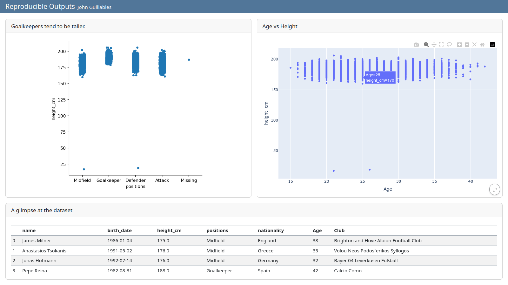

---
title: Sharing and Publishing
--- 

In this workshop we cover using GitHub for sharing your source code, Git for version control, and Quarto for publishing outputs. Specifically, we look at:

* How to create code-dependent documents, dashboards and presentation using Quarto
* How to create a Git repository on GitHub and add files to it
* How Git can help record a clean history of a project and collaborate with others
* How Git and GitHub integrate with different tools

## Quarto

[Quarto](https://quarto.org) is a publishing system that allows creating documents, presentations, websites and dashboards that contain prose, code and code outputs. This means that such outputs can detail exactly what happened to the data, and outputs can be re-generated very quickly if, for example, the underlying dataset was updated, or if the analysis needs to change.

### Installing Quarto

Follow the [instructions to install Quarto](https://quarto.org/docs/get-started/) on your computer. Quarto is a command line tool available for all major operating systems.

::: {callout-note}
We can write Quarto files in Spyder, but there is (at the time of writing) no integration of it into the Spyder interface. Other IDEs make it easier to interact with Quarto functions and write Quarto files, like R Studio.
:::

Once Quarto is installed, restart Spyder and try running `!quarto version` in Spyder's IPython console. If it returns a version number, Quarto was installed successfully and you will be able to run Quarto commands straight from Spyder (using the `!` at the beginning).

If the IPython console can't find Quarto, try to run `quarto version` (without the `!`) in a command line interface outside Spyder (bash, macOS's Terminal, PowerShell...). You will have to use the tool that finds Quarto to run Quarto commands later.

### Create a Quarto file

Let's try to create a document based on the visualisations we created earlier. Create a new Python script and save it as "document.py" at the top of the project directory.

:::{.callout-warning}
When rendering individual Quarto files, paths to files (like the one you use to import some data) will be understood as `relative to the file itself`. This means that, to avoid confusion, it is best to save your Quarto file at the top of your project directory, so you can use the same relative paths as in the rest of your scripts.
:::

This new `.py` script will be made of **cells**, which can be inserted with the toolbar or the keyboard shortcut <kbd>Ctrl</kbd>+<kbd>2</kbd>. (You can also write the delimiter `# %%` by hand if you have an older version of Spyder, or if you find it more convenient.)

At the top of our script, we need to include a Markdown cell that contains the document's settings:

```python
# %% [markdown]
# ---
# title: Reproducible Output
# author: Your Name
# date: 2025-01-01
# ---
```

All subsequent cells are going to be either `[markdown]` cells (if they contain text, titles and other static contents) or python cells (if they contain executable code). For example:

```python
# %% [markdown]
"""
## Import the data

Let's import the data:
"""

# %%
import pandas as pd
df = pd.read_csv("Players2024.csv")

# %% [markdown]
"""
## Plot the data

Let's generate that **swarm plot** again:
"""

# %%
import seaborn as sns
sns.catplot(data = df, x = "positions", y = "height_cm")

# %% [markdown]
"""
We now have a plot!
"""
```

In the Markdown cells, we use the Markdown markup language to format the text. For example, using `## ` before some text defines a heading of level 2 (level 1 being the document's title), and using `**` around some text makes it bold. See [more Markdown hints in the Quarto documentation](https://quarto.org/docs/authoring/markdown-basics.html).

### Rendering

From the IPython console, run the following command to render the document:

```
!quarto render document.py
```

If you use a different command line tool to run quarto, do not use the `!` in front:

```
quarto render document.py
```

This should create a HTML document in your project directory, which you can open in a web browser by right-clicking on it in the Files tab and using "Open externally".

#### Troubleshooting

If the rendering step fails, it might be because some modules are missing. This is more common if Quarto uses a different Python environment to Spyder. Use the right command to install the missing modules (depending on your system, `pip install` or `conda install`) and try rendering again.

If the issue relates to a missing Python kernel, you might have to install jupyter. See options for different package managers in the [Quarto documentation about Python](https://quarto.org/docs/computations/python.html#installation).

### Cell options

As the default Quarto output is a HTML file, we can include interactive visualisations too.

Let's say we also want to let our readers know that they need to install Plotly in order to create interactive visualisations. If you want to show the corresponding code in your document but don't want to run it, you can add the cell option `#| eval: false`. (And if you want to show the output but not show the underlying code, use `#| echo: false`.)

```python
# %% [markdown]
"""
## Interactive plots

You will need the plotly module:
"""

# %%
#| eval: false
conda install plotly

# %% [markdown]
"""
An interactive plot:
"""

# %%
#| echo: false
import plotly.express as px
px.scatter(data_frame = df, x = "age", y = "height_cm")
```

And for adding a caption and alternative text to a figure:

```python
# %%
#| fig-cap: "Goalkeepers tend to be taller."
#| fig-alt: "A scatterplot of the relationsip between height and position."
import seaborn as sns
sns.catplot(data = df, x = "positions", y = "height_cm")
```

[Many more cell options](https://quarto.org/docs/computations/execution-options.html) exist, including captioning and formatting visualisations. Note that these options can be used at the cell level as well as globally (by modifying the front matter at the top of the document).

For example, to make sure error and warning messages are never shown:

```python
# %% [markdown]
# ---
# title: Reproducible Output
# author: Your Name
# date: 2025-01-01
# warning: false
# error: false
# ---
```

### Output formats

The default output format in Quarto is HTML, which is by far the most flexible. However, Quarto is a very versatile publishing system and can generate many different output formats, including PDF, DOCX and ODT, slide formats, Markdown suited for GitHub... and even whole blogs, books and dashboards.

Let's try rendering a PDF:

```python
# %% [markdown]
# ---
# title: Reproducible Output
# author: Your Name
# date: 2025-01-01
# format: pdf
# ---
```

When rendering PDFs, the first issue we might run into is the lack of a LaTeX distribution. If Quarto didn't detect one, it will suggest to install tinytex (a minimal LaTeX distribution) with:

```python
!quarto install tinytex
```

Once that is installed, Quarto should render a PDF.

Another issue with our example document is that an interactive HTML visualisation won't be renderd in the PDF. You can supress it by using the `#| eval: false` option:

```python
# %%
#| eval: false
import plotly.express as px
px.scatter(data_frame = df, x = "age", y = "height_cm")
```

#### Dashboard

A great way to present a variety of outputs in a grid is by creating a HTML dashboard.

Let's modify our script to render a dashboard. First, change the output format:

```python
# %% [markdown]
# ---
# title: Reproducible Output
# author: Your Name
# date: 2025-01-01
# format: dashboard
# ---
```

We can already render the dashboard and see the result. Each panel can be expanded with the bottom-right button. Note that by default:

* each cell is rendered in a separate card
* headings define the rows
* the heading text is discarded
* code is not shown (but can be by using `echo: true`)

Given this default behaviour, you might have to rethink a good part of your script to make it suited for a striking dashboard. For example, removing most of the text, customising the layout (tabsets, rows, card heights...) and adding custom cards like "value boxes". Learn more about all these in the [Quarto Dashboards documentation](https://quarto.org/docs/dashboards/).

As a starting point, copy the current script across to a new script called `dashboard.py` and modify it so it matches the following:

```python
# %% [markdown]
# ---
# title: Reproducible Outputs
# author: Your Name
# date: today
# warning: false
# error: false
# format: dashboard
# ---

# %%
import pandas as pd
df = pd.read_csv("Players2024.csv")

# %% [markdown]
"""
## Figures {height=70%}
"""

# %%
#| title: Goalkeepers tend to be taller
#| fig-alt: "A scatterplot of the relationsip between height and position."
import seaborn as sns
sns.catplot(data = df, x = "positions", y = "height_cm")

# %%
#| title: Age vs Height
import plotly.express as px
px.scatter(data_frame = df, x = "age", y = "height_cm")

# %% [markdown]
"""
## Table
"""

# %%
#| title: A glimpse at the dataset
df.head(10)
```

This results in a dashboard containing three cards organised in two rows. The top row uses 70% of the available height, and the bottom row shows a table of the top 10 rows of the dataset. Each card has a title.



### Themes

To quickly style your dashboard differently, you can use a Bootstrap theme in your header like so:

```
# %% [markdown]
# ---
# title: Reproducible Outputs
# author: Your Name
# date: today
# warning: false
# error: false
# format:
#   dashboard:
#     theme: quartz
# ---
```

See [a list of what other themes are available](https://quarto.org/docs/dashboards/theming.html).

## Git and GitHub

**Git** is a version control system that allows to record a clean history of your project, track precise authorship, and collaborate asynchronously with others. It can be used offline, from the command line or with integration into Integrated Desktop Environments (like RStudio, VS Code... Unfortunately, Spyder does not have Git integration).

**GitHub** is one of many websites that allow you to host project that are tracked with Git. But even without using Git at all, it is possible to use GitHub to share and make your project public. Many researchers use it to make their code public alongside a published paper, to increase reproducibility and transparency. It can also be useful to build and share a portfolio of your work.

Learning about the ins and out of Git takes time, so in this section we will mainly use GitHub as a place to upload and share your code and outputs, and as a starting point for learning more about Git in the future.

### GitHub

[GitHub](https://github.com/) is currently the most popular place for hosting, sharing and collaborating on code. You can create an account for free, and then create a **repository** for your project.

1. Create an account and log in
1. Click on the "+" button (top right of the page)
1. Select "New repository"
1. Choose a name and description for your repository
1. Tick "Add a README file" - this will be where you introduce your project
1. Click "Create repository"

From there, you can upload your files, and edit text-based files straight from your web browser if you need to.

The README file is a markdown file that can contain the most important information about your project. It's important to populate it as it is the first document most people see. It could contain:

* Name and description of the project
* How to use it (installation process if any, examples...)
* Who is the author, who maintains it
* How to contribute

For inspiration, see the [pandas README file](https://github.com/pandas-dev/pandas?tab=readme-ov-file#pandas-powerful-python-data-analysis-toolkit).

To practice managing a git repository on GitHub, try creating a personal portfolio repository where you can showcase what you have worked on and the outputs your are most proud of.

## Further resources

* Some alternatives to GitHub: [Codeberg](https://codeberg.org/) and [Gitlab](https://gitlab.com)
* [Quarto documentation](https://quarto.org/)
* [Course on Git from the command line](https://github.com/uqlibrary/technology-training/blob/master/Git/git.md)
* [Course on Git with GitHub](https://github.com/uqlibrary/technology-training/blob/master/Git/GitHub/GitHub_intro.md)
* [How to use GitHub Pages to publish Quarto outputs](https://quarto.org/docs/publishing/github-pages.html)
